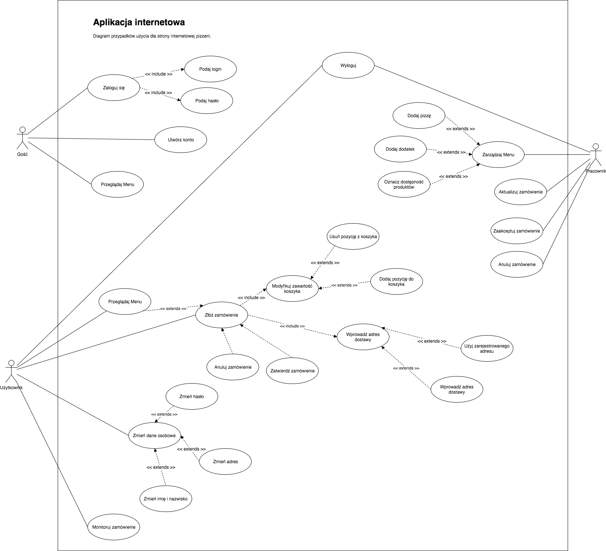

##
# Strona internetowa pizzerii

Monika Wiech, Kamil Michno, Paweł Paruzel, Piotr Persona, Rafał Ziobro

1.
###
### 1.
 Diagram przypadków użycia

Aktorzy:

- Gość - osoba odwiedzająca stronę, niezalogowana. Ma możliwość zalogowania się, utworzenia nowego konta oraz przeglądania menu pizzerii. Po udanych zalogowaniu gość staje się użytkownikiem aplikacji.
- Użytkownik - osoba zalogowana do aplikacji. W przeciwieństwie do gościa, użytkownik nie ma możliwości utworzenia nowego konta, ani logowania się na inne konto. Użytkownik ma możliwość składania zamówienia, zmiany danych osobowych powiązanych z kontem, monitorowania złożonego zamówienia oraz wyświetlania historii zamówień.
- Pracownik - osoba zatrudniona lokalnie w pizzerii, posiadająca odpowiednie uprawnienia umożliwiające zarządzanie menu oraz zarządzanie zamówieniami użytkowników.

 

| **UC Złóż zamówienie** |   |   |
| --- | --- | --- |
|   |   |   |
| **Aktor:** | Użytkownik | **Scenariusz podstawowy** |
| **System przed:** | Bezczynny | 1. Użytkownik wyraża chęć złożenia zamówienia |
| **System po:** | Oczekujący na potwierdzenie zamówienia | 2. System prosi o wybranie produktu oraz dodatków |
|   |   | 3. Użytkownik wprowadza żądane informacje i zatwierdza je |
|   |   | 4. System prosi o wprowadzenie adresu dostawy zamówienia |
|   |   | 5. Użytkownik wprowadza żądane informacje i zatwierdza je |
|   |   | 6. System zwraca podgląd zamówienia oraz przewidywany czas dostawy |
|   |   | 7. Użytkownik zatwierdza zamówienie |
|   |   | 7a. Użytkownik odrzuca zamówienie |
|   |   | 8. Użytkownik wybiera metodę płatności za zamówienie |
|   |   | 9. System oczekuje na potwierdzenie ze strony pracownika |

| **UC Zatwierdź zamówienie** |   |   |
| --- | --- | --- |
|   |   |   |
| **Aktor:** | Pracownik | **Scenariusz podstawowy** |
| **System przed:** | Oczekujący na potwierdzenie zamówienia | 1. Pracownik zatwierdza zamówienie |
| **System po:** | Bezczynny | 1a. Pracownik odrzuca zamówienie |
|   |   | 2. System prosi o potwierdzenie operacji |
|   |   | 3. System zwraca informacje o stanie zamówienia |

| **UC Dodaj pozycję w menu** |   |   |
| --- | --- | --- |
|   |   |   |
| **Aktor:** | Pracownik | **Scenariusz podstawowy** |
| **System przed:** | Oczekujący na dodanie pozycji w menu | 1. Pracownik wyraża chęć dodania nowej pozycji w menu |
| **System po:** | Bezczynny | 2. System prosi o wybranie typu pozycji |
|   |   | 3. Użytkownik wybiera typ nowej pozycji w menu |
|   |   | 4. System prosi o wprowadzenie szczegółów nowej pozycji |
|   |   | 5. Użytkownik wprowadza żądane informacje i zatwierdza je |
|   |   | 6. System zwraca podgląd zmian w menu |
|   |   | 7. Pracownik zatwierdza modyfikacje w menu |
|   |   | 7a. Pracownik odrzuca modyfikacje w menu |
|   |   | 7a.a. System pyta czy pracownik chciałby dokonać zmian |
|   |   | 7a.b. Użytkownik zatwierdza lub odrzuca prowadzenie zmian |
|   |   | 8. System informuje o wyniku operacji |
|   |   | 9. System dodaje nową pozycję do bazy danych i informuje o wyniku operacji |

1.
###
### 2.
 Wymagania interfejsu od strony użytkownika

- Jako użytkownik chce móc zalogować się do systemu
- Jako użytkownik chce móc zamówić pizzę
- Jako użytkownik chce mieć możliwość monitorowania zamówienia
- Jako użytkownik chce mieć przeglądania historii zamówienia
- Jako gość chce mieć możliwość zarejestrowania i zalogowania się do systemu
- Jako pracownik chce móc zarządzać menu
- Jako pracownik chce móc zarządzać zamówieniami użytkowników